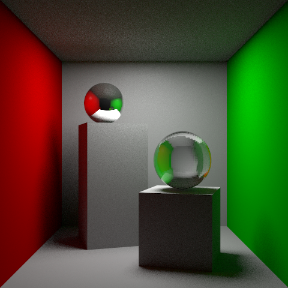

# ✨ CS148 @ Stanford

## 💻 Runtime Environment

- **Platform:** Blender (version 4.3 recommended)  
 >Note: u can try higher version of Blender to run the Python scripts maybe. Cuz the 
 scripts uses the basic API of Blender which shouldn't changed much over time.
- **Rendering Device:** Apple M1 Chip (8 core CPU + 8 core GPU)  
- **Render Time Summary (with global illumination):**
 >Note: this runs **VERY SLOW**, cuz theres **NO GPU acceleration**.

| Scripts                                       |Resolution|Samples|Depth|Time (approx.)|
|-----------------------------------------------|----------|-------|-----|--------------|
| `./HW5_global_illumination/simpleRT_plugin.py`| $480^2$  | 64    |  4  |2:15:00 😭   |
| `./HW5_global_illumination/simpleRT_plugin.py`| $480^2$  | 128   |  4  |3:20:00 ☠️   |

The result of 64 sampling, with depth 4, & global illumination.

The result of 128 sampling, with depth 4, & global illumination.

---

## 🚀 How to Run

I run all these scripts using Blender GUI. 

### HW3

You can download the scene on CS148 official website. The .blender file (the scene) contains 
two embedded scripts. You can replace the content of `simpleRT_plugin.py` with any of my .py files under
`./HW3_simple_RT` such as `./HW3_simple_RT/step1.py`. Then u should first click ***text***, and ***run text*** `simpleRT_UIpanels.py`
 to let the Blender know the existence of our self implemented ray tracer. Next u should ***run text*** `simpleRT_plugin.py`.
Finally u can click ***render***, and ***render image*** to render the scene.

### HW5

ALL the same as above.

---

## 👤 Author

wjswjsss. A senior @ NEU (China).

## Acknowledgements

Thanks to the Stanford CS148 course team.
